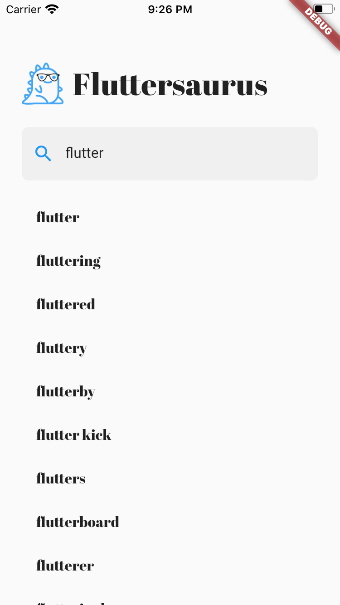
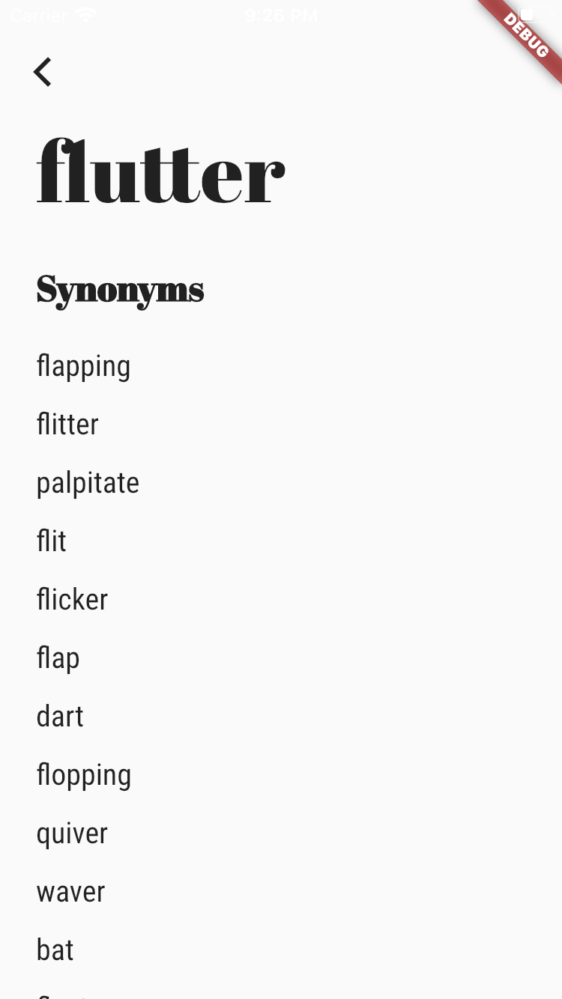

# fluttersaurus

A Flutter Thesaurus that uses the [Datamuse API](http://www.datamuse.com/api).

- ### [Complete video](https://youtu.be/ulbY6QcVzzI)!
- ### [Complete slides](./slides/bloc+cubit.pdf)!

<table>
    <tr>
        <td style="text-align: center">
            
        </td>            
        <td style="text-align: center">
                        
        </td>
        <td style="text-align: center">
            
        </td>
    </tr>
</table>
