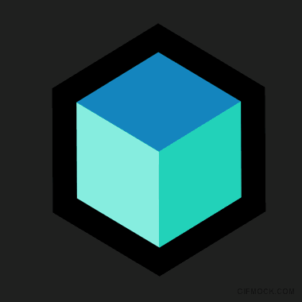
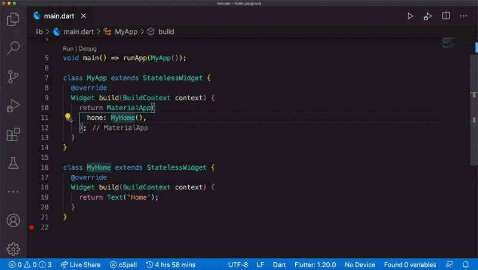

footer: @felangelov - byteconf 2020
slidenumbers: true

# Bloc 💙 Cubit

### The new kid on the bloc



### Felix Angelov @ Very Good Ventures

---

# Very Good Ventures, Chicago 🕶️🦄


### [https://verygood.ventures](https://verygood.ventures)

---

# Agenda

- What's new in bloc v6.0.0
- Meet Cubit
- Cubit vs. Bloc
- Fluttersaurus (live coding)

---

# What's New?

---

# Initial State Changes

```dart
// OLD
class CounterBloc extends Bloc<CounterEvent, int> {
  @override
  int get initialState => 0;

  ...
}

// NEW
class CounterBloc extends Bloc<CounterEvent, int> {
  CounterBloc() : super(0);

  ...
}
```

---

# Bloc Test Simplifications

```dart
// OLD
blocTest<CounterBloc, CounterEvent, int>(
  'emits [1] when increment is called',
  build: () async => CounterBloc(),
  act: (bloc) async => bloc.add(CounterEvent.increment),
  expect: const <int>[1],
);

// NEW
blocTest<CounterBloc, int>(
  'emits [1] when increment is called',
  build: () => CounterBloc(),
  act: (bloc) => bloc.add(CounterEvent.increment),
  expect: const <int>[1],
);
```

---

# BlocDelegate -> BlocObserver

```dart
// OLD
class MyBlocDelegate extends BlocDelegate {
  ...
}

// NEW
class MyBlocObserver extends BlocObserver {
  ...
}
```

---

# BlocObserver onError accepts Cubit

```dart
// OLD
class MyBlocObserver extends BlocObserver {
  @override
  void onError(Bloc bloc, Object error, StackTrace stackTrace) {
    super.onError(bloc, error, stackTrace);
  }
}

// NEW
class MyBlocObserver extends BlocObserver {
  @override
  void onError(Cubit cubit, Object error, StackTrace stackTrace) {
    super.onError(cubit, error, stackTrace);
  }
}
```

---

# BlocSupervisor Removed

```dart
void main() {
  // OLD
  BlocSupervisor.delegate = MyBlocDelegate();

  // NEW
  Bloc.observer = MyBlocObserver();
}
```

---

# Tooling Improvements



---

# Complete migration guide

# [https://bloclibrary.dev/#/migration](https://bloclibrary.dev/#/migration)

---

# Meet Cubit

> Cubit = Bloc - Events

[.column]


[.column]


---

# CounterCubit

```dart
import 'package:bloc/bloc.dart';

class CounterCubit extends Cubit<int> {
  CounterCubit() : super(0);

  void increment() => emit(state + 1);
}
```

---

# Cubit vs. Bloc

[.column]

**Cubit**

```dart
class CounterCubit extends Cubit<int> {
  CounterCubit() : super(0);

  void increment() => emit(state + 1);
}
```

[.column]

**Bloc**

```dart
enum CounterEvent { increment }

class CounterBloc extends Bloc<CounterEvent, int> {
  CounterCubit() : super(0);

  @override
  Stream<int> mapEventToState(CounterEvent event) async* {
    switch (event) {
      case CounterEvent.increment:
        yield state + 1;
        break;
    }
  }
}
```

---

Cubit vs. Bloc

|                     | Cubit | Bloc |
| ------------------- | :---: | :--: |
| Simple              |  ✅   |      |
| Concise             |  ✅   |      |
| Traceable           |       |  ✅  |
| ReactiveX Operators |       |  ✅  |
| Testable            |  ✅   |  ✅  |
| Scalable            |  ✅   |  ✅  |
| Tooling Support     |  ✅   |  ✅  |

---

# Fluttersaurus


### https://github.com/felangel/fluttersaurus

---

# Thanks! 🙏

## Twitter @felangelov

## Github @felangel
